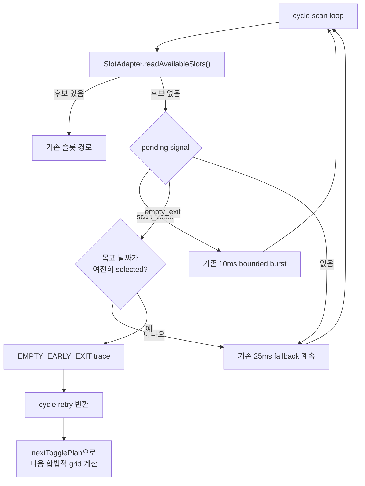

# RT-14 설계 - EXACT EMPTY cycle 조기 종료

## 1. 범위

포함:

- XHR 모드 `off | observe | empty_exit`
- 현재 cycle의 `EXACT EMPTY` 신호
- DOM 우선권을 보존하는 cycle 조기 종료
- 구조화 trace와 기존 설정 마이그레이션

제외:

- MutationObserver 제어 wake
- 이전 cycle POPULATED 수락 완화
- 토글 간격·20/40/60ms 상수 변경
- 직접 API 요청과 body 기반 슬롯 클릭

## 2. 설정 계약

```ts
type AvailabilityProbeMode = "off" | "observe" | "empty_exit";

interface ReservationConfig {
  availabilityProbeMode?: AvailabilityProbeMode;
  /** legacy persisted field */
  availabilityProbeEnabled?: boolean;
}
```

정규화:

| 입력 | 현재 값 |
|---|---|
| `availabilityProbeMode` 유효 | 해당 mode |
| legacy `availabilityProbeEnabled=true` | `observe` |
| legacy `false` 또는 누락 | `off` |

정규화 결과에는 `availabilityProbeMode`만 남기고 legacy boolean은 제거한다. 저장 설정 fingerprint에는 실행 진단·실험 mode를 포함하지 않는다.

Background는 `mode !== "off"`일 때만 MAIN probe를 설치한다. Content는 `mode === "empty_exit"`일 때만 EMPTY 제어를 허용한다.

## 3. UI

고급 설정의 기존 `XHR 응답 진단` 체크박스를 하나의 mode fieldset으로 교체한다.

```text
XHR 응답 모드
[ 사용 안 함 ] [ 진단만 ] [ EMPTY 조기 종료 ]
```

- native radio 3개를 segmented control처럼 표시한다.
- 기본값은 `사용 안 함`이다.
- `진단만`은 현재 probe·POPULATED wake 의미를 유지한다.
- `EMPTY 조기 종료`는 진단을 포함하며 추가로 RT-14 제어를 허용한다.
- 세 mode가 상호 배타적이므로 별도 종속 체크박스를 두지 않는다.

## 4. 신호 계약

`AvailabilityDomWake`의 active cycle·sequence·waiter 소유권을 재사용한다.

```ts
type AvailabilityWakeSignal =
  | {
      kind: "scan_wake";
      quality: "EXACT" | "STRONG";
      selectedMinutes: number;
      // existing timing fields
    }
  | {
      kind: "empty_exit";
      quality: "EXACT";
      selectedMinutes: null;
      // same timing fields
    };
```

offer 입력에는 body classification과 `allowEmptyExit`을 추가한다.

### scan_wake

기존 조건을 그대로 유지한다.

- `EXACT | STRONG`
- current active cycle
- non-stale, 최신 sequence
- 범위 일치 selected minutes 존재
- timing 유효

### empty_exit

다음을 모두 만족해야 한다.

- `classification === "EMPTY"`
- `allowEmptyExit === true`
- `quality === "EXACT"`
- current active cycle
- non-stale, 최신 sequence
- selected minutes 없음
- timing 유효

`observe` mode의 EMPTY는 기존과 같이 `no_matching_slot`으로 거부한다. `STRONG EMPTY`는 `untrusted_quality`로 거부한다.

## 5. 오케스트레이터 순서



핵심 순서는 **DOM scan이 신호 처리보다 항상 먼저**다. EMPTY와 슬롯 DOM이 동시에 관측되면 슬롯 후보가 승리한다.

목표 날짜 선택 재확인은 EMPTY를 body 권위로 승격하지 않기 위한 UI guard다. 실패하면 조기 종료하지 않고 기존 fallback을 계속한다. 선택 확인 중 슬롯이 렌더되는 race를 막기 위해 guard 통과 직후 DOM을 한 번 더 읽고, 이 최종 검사에서도 후보가 있으면 조기 종료하지 않는다.

## 6. cycle 결과와 trace

`DATE_TOGGLE_CYCLE.result`에 `EMPTY_EARLY_EXIT`를 추가한다.

`AVAILABILITY_SHADOW`의 body phase에는 기존 필드와 함께 다음을 남긴다.

- `signalKind`
- `wakeAccepted`
- `wakeDiscardReason`

조기 종료 적용 시 별도 phase `empty_early_exit`:

- cycle, requestSequence, correlationQuality
- response/bridge/signal monotonic time
- `bodyToExitMs`
- `targetStillSelected`
- `finalDomCandidateFound=false`
- `emptyEarlyExitApplied=true`

목표 날짜 선택이 풀려 적용하지 않은 경우에도 같은 phase에 `emptyEarlyExitApplied=false`를 남긴다. trace 실패는 실행 결과를 바꾸지 않는다.

## 7. 안전 불변식

1. body는 클릭하지 않는다.
2. `SlotAdapter`가 반환한 후보가 EMPTY보다 우선한다. 이 우선권은 최초 scan과 목표 날짜 guard 직후 최종 scan 모두에 적용한다.
3. `STRONG`, stale, inactive, duplicate EMPTY는 제어에 사용하지 않는다.
4. probe off와 observe mode의 기존 실행 결과·cadence는 유지한다.
5. 조기 종료 후에도 `nextTogglePlan()`과 stop/timeout을 그대로 사용한다.
6. 한 cycle에 signal waiter와 scan loop는 하나다.
7. 설정 누락과 legacy true는 각각 off와 observe로 복원한다.
8. 실오픈 검증 전 기본값은 off다.

## 8. 롤백

- 사용자는 mode를 `진단만` 또는 `사용 안 함`으로 바꿔 즉시 RT-14를 비활성화할 수 있다.
- 구현 결함 시 `empty_exit` 분기만 제거해도 기존 POPULATED wake와 polling은 남는다.
- 저장된 `empty_exit` 설정은 구버전 코드에서 알 수 없는 optional 필드로 무시되고 legacy boolean 누락에 따라 probe off가 된다.
