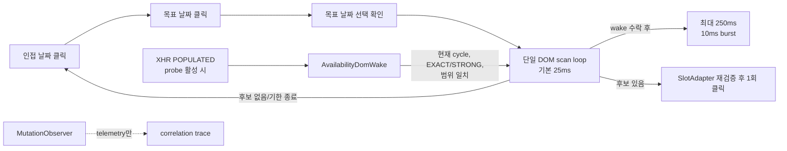
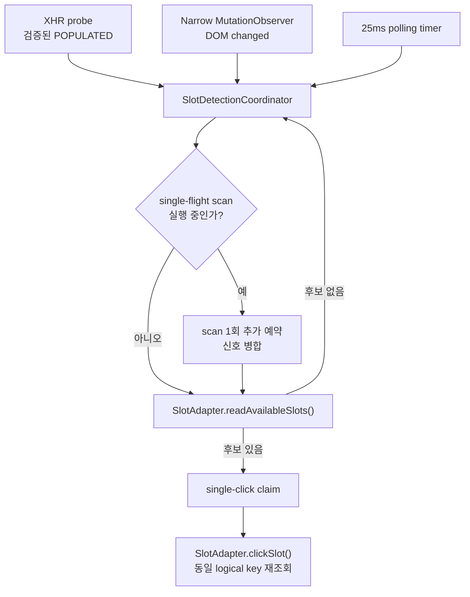
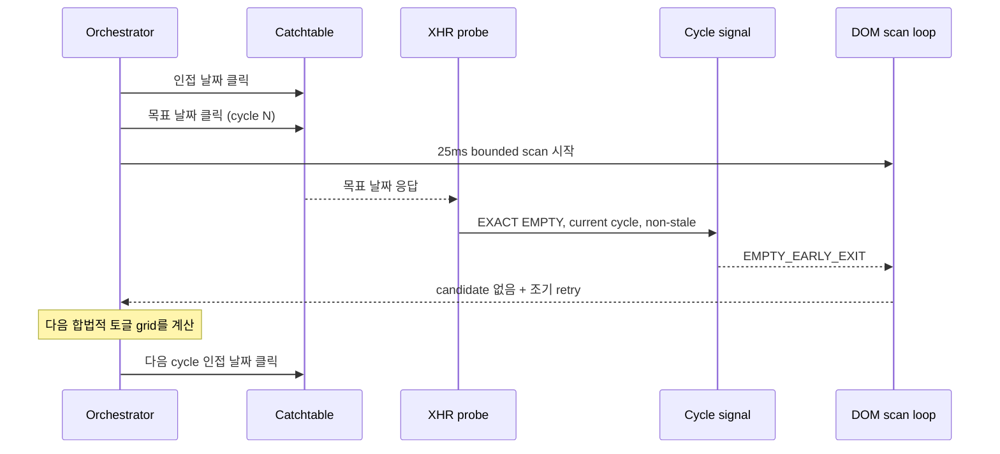

# 3신호 슬롯 감지 구조와 EXACT EMPTY 조기 종료

**작성일:** 2026-07-16  
**상태:** 설계 후보 기록, 구현 미승인  
**관련 항목:** RT-13, RT-14, 후속 3신호 제어 연구

## 1. 목적

실제 오픈 26건 분석에서 슬롯 감지 이후 dispatch는 빠르지만, 오픈 이후 유효한 목표 날짜 요청을 만들고 DOM이 렌더될 때까지가 지배 구간이었다.

- 감지 → dispatch 탐색적 p50: 약 14ms
- 오픈 → 최종 목표 날짜 클릭: 서버 게시 지연과 cycle 양자화가 섞인 약 914ms
- 목표 날짜 클릭 → DOM 감지 탐색적 p50: 약 199ms

따라서 이 문서는 다음 두 개선 후보를 혼동하지 않도록 분리한다.

1. **3신호 슬롯 감지:** POPULATED XHR, DOM mutation, 25ms polling을 한 coordinator에 연결한다.
2. **EXACT EMPTY 조기 종료:** 현재 cycle의 슬롯 대기를 일찍 끝내 다음 날짜 토글 기회를 앞당긴다.

두 후보는 독립적이다. EMPTY 조기 종료를 위해 MutationObserver 제어 연결이나 3신호 전체 구현이 필요하지 않다.

## 2. 현재 구조

현재 일반 실행은 XHR probe가 기본 비활성이고 25ms bounded DOM polling만 사용한다. 진단 실행에서 probe를 켜면 검증된 현재 cycle의 POPULATED body가 polling wait를 깨우고 최대 250ms 동안 10ms burst scan을 허용한다.

`SlotDomMutationWatch`는 이미 존재하지만 generation과 마지막 mutation 시각을 남기는 telemetry 전용이다. 제어 wake로 사용하지 않는다.



현재 XHR wake의 한계는 다음과 같다.

- `AvailabilityDomWake.offer()`는 선택 가능한 분이 없는 body를 `no_matching_slot`으로 거부한다.
- 이전 cycle에서 늦게 도착한 POPULATED는 `inactive_cycle`로 거부한다.
- MutationObserver는 DOM 생성 직후 scan을 깨우지 않는다.
- probe가 꺼진 운영 기본 구성에서는 XHR 신호 자체가 없다.

## 3. 3신호 목표 구조

### 3.1 각 신호의 책임

| 신호 | 알려 주는 사실 | 알려 주지 못하는 사실 | 허용 행동 |
|---|---|---|---|
| XHR POPULATED | 응답 시점에 설정 범위와 일치하는 가용 슬롯이 존재함 | 현재 DOM이 렌더됐고 클릭 가능함 | 목표 날짜 유지, scan wait 해제, bounded 집중 탐색 |
| DOM mutation | 관찰 범위의 DOM이 변경됨 | 그 변경이 슬롯이며 현재 cycle 응답 결과임 | 즉시 `SlotAdapter.readAvailableSlots()` 재검사 |
| 25ms polling | 현재 DOM을 주기적으로 직접 확인함 | 서버 응답이 도착했는지 | 항상 유지되는 fallback 검사 |

어떤 신호도 직접 클릭하지 않는다. 최종 후보 판정은 `SlotAdapter.readAvailableSlots()`, 클릭 직전 재검증은 `SlotAdapter.clickSlot()`만 수행한다.

### 3.2 단일 coordinator

세 신호가 각각 별도 click loop를 만들면 중복 클릭과 순서 경쟁이 생긴다. 따라서 한 cycle에 detector는 하나만 두고, 신호는 detector의 다음 scan 시점만 앞당긴다.



필수 불변식:

1. 한 cycle에 scan 실행은 최대 하나다.
2. scan 중 도착한 신호는 합쳐서 후속 scan 최대 1회만 예약한다.
3. MutationObserver callback에서는 DOM 전체 탐색이나 trace 전송을 하지 않는다.
4. POPULATED는 현재 cycle, `EXACT | STRONG`, non-stale, 설정 범위 일치일 때만 제어에 사용한다.
5. observer와 probe가 실패해도 25ms polling은 그대로 동작한다.
6. 후보 click claim은 한 번만 성공할 수 있고, 클릭 직전 DOM을 다시 읽는다.
7. stop/timeout과 기존 bounded render window를 넘지 않는다.

### 3.3 권장 observer 범위

현재 `SlotDomMutationWatch`는 `document.documentElement` 전체의 `subtree`, `childList`, `attributes`를 본다. 이를 그대로 제어 신호로 승격하면 사이드패널과 무관한 페이지 mutation에도 과도한 scan이 발생할 수 있다.

제어용 observer는 다음 순서로 좁혀야 한다.

1. 활성 예약 drawer 또는 dialog root
2. 슬롯 버튼을 포함하는 가장 가까운 안정적 container
3. root가 교체되면 상위 observer가 새 root를 한 번 재연결

실제 안정적 root 증거가 없으면 전체 문서 observer를 제어에 사용하지 않고 telemetry 상태를 유지한다.

### 3.4 기대 효과의 상한

- MutationObserver: 평균적으로 25ms polling 잔여 중 일부, 최대 약 25ms를 줄일 가능성이 있다.
- POPULATED wake: 다음 25ms scan을 앞당기고 250ms render window를 보존할 수 있다.
- polling: 성능 향상보다 신호 누락·오분류 시 성공률을 보존한다.

따라서 3신호만으로 수백 ms 개선을 기대하면 안 된다. 큰 tail 개선 가능성은 이전 cycle POPULATED를 안전하게 보존하는 RT-13에 있으나, stale UI와 응답 역전 위험 때문에 별도 분석이 필요하다.

## 4. EXACT EMPTY 조기 종료 단독안

### 4.1 결론

EMPTY 조기 종료는 3신호 전체와 독립적으로 구현할 수 있다. 기존 XHR probe와 cycle correlation을 재사용하고, 현재 cycle의 신뢰된 EMPTY가 도착했을 때 남은 DOM 대기를 끝내 `runToggleCycle()`이 `retry`를 반환하게 하면 된다.

현재 `AvailabilityDomWake`가 POPULATED 전용이므로 구현은 단순한 조건문 한 줄이 아니라 다음 작은 계약 변경이 필요하다.

```text
현재:
  verified POPULATED + matching slot -> wake(scan_now)
  EMPTY                            -> reject(no_matching_slot)

후보:
  verified POPULATED + matching slot -> signal(POPULATED_WAKE)
  verified EMPTY                     -> signal(EMPTY_EARLY_EXIT)
  그 외                               -> reject(reason)
```

### 4.2 단독 흐름



3신호 구조와 달리 MutationObserver는 건드리지 않으며 POPULATED wake와 25ms polling도 기존대로 둔다.

### 4.3 반드시 지킬 수용 조건

다음 조건을 모두 만족한 EMPTY만 현재 cycle을 조기 종료할 수 있다.

- `classification === "EMPTY"`
- correlation quality가 `EXACT`
- `cycle === activeCycle`
- `stale === false`
- request date가 목표 예약 날짜와 일치
- person count가 설정과 일치
- request sequence가 해당 cycle에서 아직 처리하지 않은 최신 값
- 목표 날짜 클릭 이후 발생한 요청
- 목표 날짜 선택 상태가 여전히 확인됨

`STRONG EMPTY`는 조기 종료에 사용하지 않는다. false-empty가 발생하면 실제 열린 슬롯의 DOM 렌더를 기다리지 않고 다음 날짜로 이동할 수 있으므로 POPULATED wake보다 더 보수적으로 취급한다.

### 4.4 스케줄 정책

조기 종료는 **즉시 인접 날짜를 다시 클릭한다는 뜻이 아니다.** 기존 `nextTogglePlan()`의 다음 합법적 토글 grid를 다시 계산해 따른다.

이 제약을 유지하면:

- 현재 cycle의 불필요한 700ms quiesce 또는 남은 bounded scan은 줄일 수 있다.
- 설정된 최소 토글 간격보다 빠른 무제한 요청을 만들지 않는다.
- stop/timeout과 사용자 중지 의미를 보존한다.

만약 현재 `nextTogglePlan()`이 이미 다음 grid까지 기다리게 해 이론 절감이 거의 없다면, EMPTY 조기 종료를 구현해도 성능 이득이 없다. 따라서 구현 전 counterfactual 분석이 먼저다.

### 4.5 위험

| 위험 | 설명 | 완화 |
|---|---|---|
| false EMPTY | 분류 또는 correlation 오류로 열린 슬롯을 놓침 | EXACT only, current cycle, 목표 날짜/인원/선택 상태 재검증 |
| 응답 역전 | 이전 요청 EMPTY가 새 POPULATED 뒤 도착 | request sequence와 active cycle 강제 |
| 렌더 지연 | EMPTY 응답 뒤 기존/다른 응답 DOM이 늦게 생성 | 현재 cycle의 정확한 요청만 사용, 실측 fixture 및 race 테스트 |
| 요청 빈도 증가 | 대기 단축으로 XHR 빈도가 늘어남 | 기존 grid와 최소 간격 유지, 실행당 cycle·요청 수 계측 |
| probe 의존 | 운영 기본은 probe off이므로 효과 없음 | 실험 기능으로만 검증 후 별도 활성화 결정 |

## 5. 구현 순서와 독립성

권장 순서는 다음과 같다.

1. **RT-14 분석:** 기존 실제 오픈 CSV로 EXACT EMPTY 시점과 다음 target click을 재구성한다.
2. 이론 절감 중앙값과 요청 증가량을 계산한다.
3. 절감 중앙값이 100ms 이상이고 요청 증가가 기존 grid 범위라면 EMPTY 단독 설계를 승인한다.
4. EMPTY 단독 구현·fixture·race 테스트·probe-on 실오픈 검증을 수행한다.
5. 그 뒤에도 감지 잔여가 의미 있으면 MutationObserver 제어 연결을 별도 검토한다.
6. RT-13 이전 cycle POPULATED 보존은 가장 마지막에 별도 안전성 분석한다.

독립 개발 단위:

| 단위 | XHR 필요 | MutationObserver 제어 필요 | polling 변경 | 예상 성격 |
|---|---:|---:|---:|---|
| EXACT EMPTY 조기 종료 | 예 | 아니오 | 종료 신호만 추가 | cycle 주기 최적화 |
| 3신호 중 observer 연결 | 아니오 | 예 | timer와 신호 병합 | 최대 25ms 잔여 단축 |
| POPULATED wake | 예 | 아니오 | 이미 10ms burst 존재 | 현재 구현 완료, 진단 전용 |
| inactive-cycle latch | 예 | 아니오 | window 보존 변경 | tail 개선 후보, 고위험 |

## 6. 검증 gate

EMPTY 단독 구현을 승인하려면 다음을 먼저 만족한다.

- 기존 26건에서 EXACT EMPTY counterfactual을 재현 가능한 스크립트로 계산
- 이론 절감 중앙값, p95, 추가 cycle/요청 수 보고
- false EMPTY, stale, inactive cycle, duplicate, 응답 역전 단위 테스트
- EMPTY가 없거나 probe가 꺼진 경우 기존 cycle timing과 동일
- POPULATED, malformed, observer 실패 시 기존 fallback 동일
- 전체 `npm run check` 통과
- 중요한 예약이 아닌 실제 오픈 probe-on 표본에서 dropped 0과 정확한 cycle 종료 확인

3신호 전체 구현은 여기에 narrow observer root 실증, single-flight scan, mutation storm, 중복 click claim 테스트를 추가로 요구한다.

## 7. 현재 결정

- 3신호 구조: **기록만 하고 구현하지 않는다.** 기대 상한과 observer 범위 증거가 부족하다.
- EXACT EMPTY 조기 종료: **RT-14 독립 분석 대상으로 승격 가능하다.** 3신호 구현을 선행 조건으로 두지 않는다.
- 중요 예약 기간 hot path 변경 금지 조건은 유지한다. 분석과 counterfactual 계산은 코드 실행 경로를 바꾸지 않으므로 먼저 수행할 수 있다.
